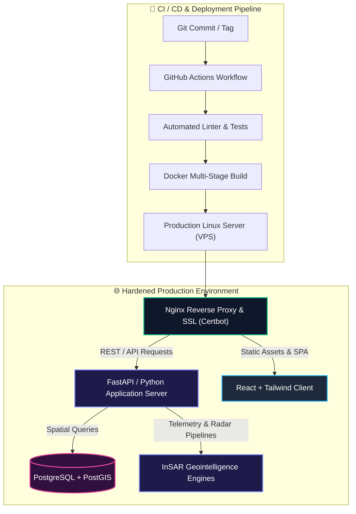

<div align="center">

<!-- HEADER BANNER ANIMADO CON ONDAS Y GRADIENTE TECH -->


<br/>

<!-- BADGES DE CONTACTO ESTILO FLAT-SQUARE -->
[](https://github.com/hxcdevnull)
[](https://www.linkedin.com/in/christian-ferr%C3%ADn-alvarez-2576963b8/)
[](mailto:ferrinalvarezchris@gmail.com)
[](#)
[](#)

<br/>

> *"Bridging executive technical strategy, resilient platform engineering, and high-velocity systems architecture."*

</div>

---

## 🏛️ Executive Summary & Leadership Impact

Executive technologist and hands-on Platform/DevOps Architect specializing in designing resilient distributed systems, mission-critical telemetry/geospatial data platforms, and high-performance engineering cultures.

```
┌───────────────────────────────┬─────────────────────────────────────────────────────────────┐
│ Core Competency               │ Strategic & Technical Focus Area                            │
├───────────────────────────────┼─────────────────────────────────────────────────────────────┤
│ 🚀 Tech Leadership            │ Architecture Governance · Scaling Teams · FinOps Strategy   │
│ ⚡ Platform Engineering       │ Container Orchestration · Multi-Stage CI/CD · Infrastructure│
│ 🛰️ Geospatial Intelligence    │ InSAR Satellite Telemetry · High-Throughput Spatial Engines │
│ 🛡️ Reliability & Security    │ Reverse Proxy Hardening (Nginx) · SSL/TLS · Zero-Trust      │
└───────────────────────────────┴─────────────────────────────────────────────────────────────┘
```

---

## 🛠️ Tech Stack & Engineering Arsenal

<div align="center">

<a href="https://skillicons.dev">
  
</a>

<br/><br/>

| Category | Tooling & Ecosystem |
| :--- | :--- |
| **Containers & Virtualization** | `Docker` `Docker Compose` `Multi-Stage Image Optimization` `Rootless Containers` |
| **Servers & OS Administration** | `Linux (Debian/Ubuntu)` `Bash / Shell Scripting` `Systemd Services` `Nginx Reverse Proxy` |
| **Backend & Spatial Engines** | `Python (FastAPI, Flask)` `Node.js` `RESTful API Design` `PostgreSQL` `PostGIS Spatial Indexing` |
| **CI/CD & DevOps Automation** | `Git` `GitHub Actions` `Automated Deployment Pipelines` `Environment Orchestration` |
| **Frontend & Visualization** | `React` `JavaScript (ES6+)` `Tailwind CSS` `Vite` `Interactive Map Engines` |
| **Specialized Processing** | `InSAR Satellite Radar Analytics` `Geospatial Big Data` `Telemetry Risk Models` |

</div>

---

## 🏗️ Production Architecture Blueprint



---

## 🌟 Key Initiatives & Impact Areas

<details open>
<summary><b>🛰️ Geospatial Intelligence & InSAR Radar Telemetry</b></summary>
<br/>
Designed and engineered end-to-end data processing pipelines for high-volume satellite radar telemetry (InSAR), enabling predictive ground subsidence modeling, infrastructure deformation analysis, and executive geospatial reporting.
</details>

<details open>
<summary><b>⚡ Containerized Microservices & Infrastructure Hardening</b></summary>
<br/>
Implemented hardened Linux server topologies using container isolation, Nginx reverse proxying with automated TLS rotation, optimized multi-stage Docker builds, and strict environment configuration governance.
</details>

<details open>
<summary><b>🛡️ Scalable API & Spatial Database Architecture</b></summary>
<br/>
Engineered high-performance REST APIs with FastAPI and integrated PostGIS spatial indexing for instant geographic query execution over dense multi-polygon vector datasets.
</details>

---

## 📊 Dynamic GitHub Activity

<div align="center">


</div>

---

<div align="center">

<!-- FOOTER BANNER ANIMADO -->


### 🤝 Let's Connect & Build Resilient Systems

[](https://www.linkedin.com/in/christian-ferr%C3%ADn-alvarez-2576963b8/)
[](https://github.com/hxcdevnull)
[](mailto:ferrinalvarezchris@gmail.com)

</div>
