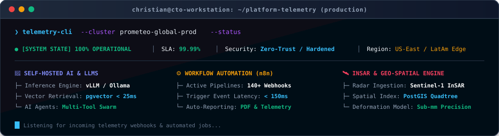

<!-- HEADER BANNER VECTORIAL LOCAL -->

  

<!-- BADGES DE CONTACTO -->

 

> *"Bridging executive technical strategy, resilient platform engineering, self-hosted AI, and hyper-automated workflow architectures."*

---

## ⚡ Live Telemetry & Platform Ops Center

  

---

## 🏛️ Executive Summary & Core Pillars

Executive technologist and hands-on Platform/DevOps Architect specializing in designing resilient distributed systems, mission-critical telemetry/geospatial data platforms, self-hosted AI systems, and complex n8n automation pipelines.

 

| 🚀 Leadership & Strategy | ⚙️ Automation & n8n | 🤖 Self-Hosted AI & LLMs | 🛰️ Geointelligence & DevOps |
| :--- | :--- | :--- | :--- |
| • Architecture Governance • Team Scaling & Mentorship • FinOps & Cost Economics | • Self-Hosted n8n Orchestration • Event-Driven Webhooks • Multi-System ETL & Sync | • Local LLMs (Ollama / vLLM) • Conversational AI Agents • RAG & pgvector Search | • InSAR Satellite Telemetry • Docker & CI/CD Pipelines • Nginx Hardening & SRE |

---

## 📈 Engineering Excellence & DORA Benchmark

| Metric | Target / Benchmark | Strategic Impact |
| :--- | :--- | :--- |
| **🚀 Deployment Frequency** | `Multiple / Day` | Continuous Feature Flow & Quick Turnaround |
| **⏱️ Lead Time for Changes** | `< 15 Minutes` | Rapid Feedback Loops (Commit to Production) |
| **🛡️ Mean Time to Recovery (MTTR)** | `< 5 Minutes` | Automated Zero-Downtime Rollbacks |
| **🎯 Change Failure Rate** | `< 0.5%` | Pre-Flight Automated Validation Matrix |
| **💰 Cloud FinOps Optimization** | `~35% Cost Savings` | Compute & GPU Resource Right-Sizing |
| **⚡ API Response Latency (P95)** | `< 45ms` | High-Throughput Async FastAPI Core |

---

## 🛠️ Engineering Arsenal & Tech Stack

  

| Domain | Core Ecosystem & Tooling |
| :--- | :--- |
| **Workflow Automation & ETL** | `n8n (Self-Hosted Production Orchestration)` `Event-Driven Webhooks` `API Middleware` `Automated Notification Dispatchers (Telegram/Email)` |
| **Self-Hosted AI & LLMs** | `Local LLM Serving (Ollama, vLLM)` `RAG Pipelines` `pgvector Semantic Search` `Conversational Chatbots` `Autonomous AI Agents` |
| **Containers & Virtualization** | `Docker` `Docker Compose` `Multi-Stage Image Optimization` `Container Isolation & Security` |
| **Servers & OS Administration** | `Linux (Debian/Ubuntu)` `Bash / Shell Scripting` `Systemd Services` `Nginx Reverse Proxy & SSL Termination` |
| **Backend & Spatial Engines** | `Python (FastAPI, Flask)` `Node.js` `RESTful & WebSocket APIs` `PostgreSQL` `PostGIS Spatial Indexing` |
| **CI/CD & DevOps Automation** | `Git` `GitHub Actions` `Automated Deployment Pipelines` `Environment Orchestration` |
| **Frontend & Visualization** | `React` `JavaScript (ES6+)` `Tailwind CSS` `Vite` `Interactive Mapbox / MapLibre Engines` |
| **Specialized Processing** | `InSAR Satellite Radar Analytics` `Geospatial Big Data` `Subsidence Forecasting & Telemetry Models` |

---

## 🏗️ Production Architecture & Delivery Blueprint

  

---

## 🌟 Flagship Initiatives & Technical Deep Dives

<b>🛰️ Geospatial Intelligence & InSAR Radar Telemetry (Prometeo Engine)</b>

 
Architected and engineered high-throughput processing pipelines for multi-temporal satellite radar telemetry (Sentinel-1 InSAR). Designed millimeter-level predictive ground deformation models, spatial risk classification algorithms, and automated PDF executive dossier generation for critical civil infrastructure.

<b>⚙️ End-to-End Workflow Automation & n8n Orchestration</b>

 
Designed and maintained enterprise-grade, self-hosted <b>n8n</b> automation infrastructure. Engineered complex event-driven webhook pipelines connecting telemetry engines, database events, multi-channel notification dispatchers (Telegram, Email, Webhooks), and automated data cleansing workflows—eliminating manual operational overhead.

<b>🤖 Self-Hosted AI, Conversational Chatbots & RAG Systems</b>

 
Architected and deployed private, self-hosted LLM inference engines (Ollama / vLLM) and real-time conversational chatbots integrated with PostgreSQL/pgvector. Implemented Retrieval-Augmented Generation (RAG) architectures to enable intelligent automated querying, synthesis of geospatial reports, and autonomous agent orchestration without external API data leakage.

<b>⚡ Containerized Microservices & Zero-Trust Server Hardening</b>

 
Implemented hardened Linux server topologies using container isolation, Nginx reverse proxying with automated TLS rotation (Certbot), optimized multi-stage Docker builds, fail2ban protection, and strict environment configuration governance.

---

<!-- FOOTER BANNER VECTORIAL LOCAL -->

  

### 🤝 Fractional CTO Advisory, Architecture & Consulting
Looking to scale engineering velocity, implement self-hosted AI, or build resilient cloud platforms?

