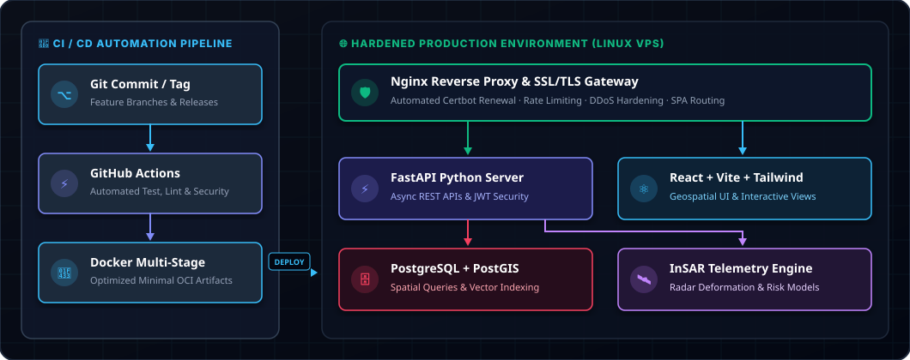

<!-- HEADER BANNER VECTORIAL LOCAL (0ms LAG / NUNCA FALLA) -->

  

<!-- BADGES DE CONTACTO -->

 

> *"Bridging executive technical strategy, resilient platform engineering, self-hosted AI, and high-velocity systems architecture."*

---

## 🏛️ Executive Summary & Core Pillars

Executive technologist and hands-on Platform/DevOps Architect specializing in designing resilient distributed systems, mission-critical telemetry/geospatial data platforms, self-hosted AI systems, and high-performance engineering cultures.

 

| 🚀 Leadership & Strategy | 🤖 Self-Hosted AI & Chatbots | ⚡ Platform & DevOps | 🛰️ Geointelligence & Data |
| :--- | :--- | :--- | :--- |
| • Architecture Governance • Team Scaling & Mentorship • FinOps & Cost Economics | • Local LLMs (Ollama / vLLM) • Conversational AI Agents • RAG & pgvector Search | • Docker Containerization • Multi-Stage CI/CD • Nginx Hardening & SSL | • InSAR Satellite Telemetry • Spatial Big Data Engines • Predictive Risk Models |

---

## 🛠️ Engineering Arsenal & Tooling

  

| Domain | Core Ecosystem |
| :--- | :--- |
| **Self-Hosted AI & LLMs** | `Local LLM Serving (Ollama, vLLM)` `RAG Pipelines` `pgvector` `Conversational Chatbots` `Autonomous AI Agents` |
| **Containers & Virtualization** | `Docker` `Docker Compose` `Multi-Stage Image Optimization` `Rootless Containers` |
| **Servers & OS Administration** | `Linux (Debian/Ubuntu)` `Bash / Shell Scripting` `Systemd Services` `Nginx Reverse Proxy` |
| **Backend & Spatial Engines** | `Python (FastAPI, Flask)` `Node.js` `RESTful & WebSocket APIs` `PostgreSQL` `PostGIS Spatial Indexing` |
| **CI/CD & DevOps Automation** | `Git` `GitHub Actions` `Automated Deployment Pipelines` `Environment Orchestration` |
| **Frontend & Visualization** | `React` `JavaScript (ES6+)` `Tailwind CSS` `Vite` `Interactive Map Engines & Chat UI` |
| **Specialized Processing** | `InSAR Satellite Radar Analytics` `Geospatial Big Data` `Telemetry Risk Models` |

---

## 🏗️ Production Architecture & Delivery Blueprint

  

---

## 🌟 Key Initiatives & Impact Areas

<b>🤖 Self-Hosted AI, Conversational Chatbots & RAG Systems</b>

 
Architected and deployed private, self-hosted LLM inference engines (Ollama / vLLM) and real-time conversational chatbots integrated with PostgreSQL/pgvector. Implemented Retrieval-Augmented Generation (RAG) architectures to enable intelligent automated querying, synthesis of geospatial reports, and autonomous agent orchestration without external API data leakage.

<b>🛰️ Geospatial Intelligence & InSAR Radar Telemetry</b>

 
Designed and engineered end-to-end data processing pipelines for high-volume satellite radar telemetry (InSAR), enabling predictive ground subsidence modeling, infrastructure deformation analysis, and executive geospatial reporting.

<b>⚡ Containerized Microservices & Infrastructure Hardening</b>

 
Implemented hardened Linux server topologies using container isolation, Nginx reverse proxying with automated TLS rotation, optimized multi-stage Docker builds, and strict environment configuration governance.

<b>🛡️ Scalable API & Spatial Database Architecture</b>

 
Engineered high-performance REST APIs with FastAPI and integrated PostGIS spatial indexing for instant geographic query execution over dense multi-polygon vector datasets.

---

<!-- FOOTER BANNER VECTORIAL LOCAL -->

  

### 🤝 Let's Connect & Build Resilient Systems

